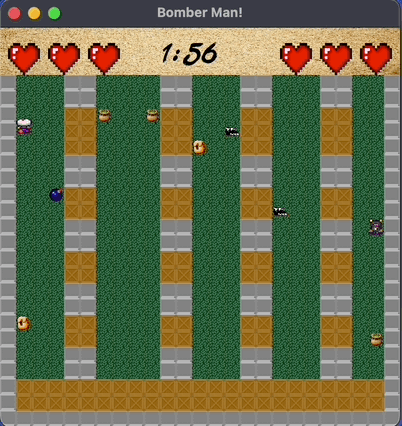

# Bomber Man

This is a two-player game where the players engage in a battle, each with three lives. The objective of the game is to defeat the opponent by strategically placing bombs and surviving until the end.

Each player starts with three lives. At the beginning of the game, each player can place up to two bombs simultaneously. The bombs will explode after a certain time period, creating an explosion radius. Players must avoid being caught in the explosion and try to trap their opponent within it.

The game ends when the time limit is reached. The player with more lives remaining at the end is declared the winner. If both players have the same number of lives, the game is a draw.

## Gameplay

* Player 1 controls: WSAD keys for movement and the space bar to place bombs.
* Player 2 controls: Arrow keys (↑↓←→) for movement and the 'M' key to place bombs.

## Demo
